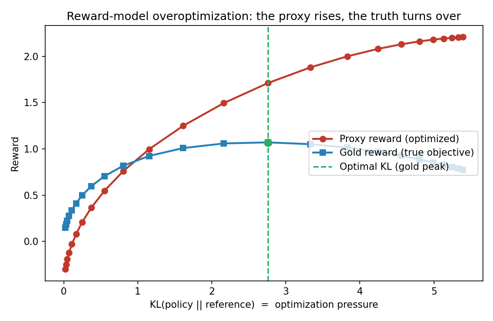
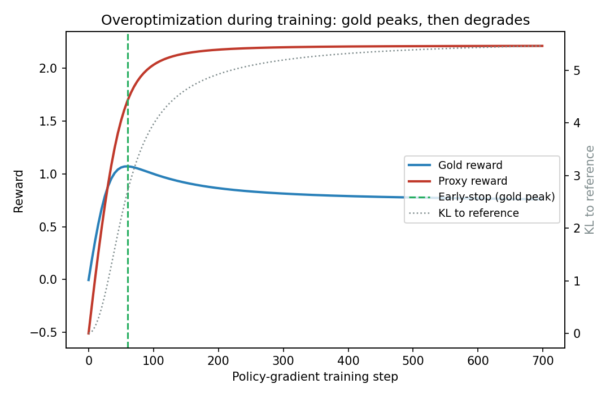
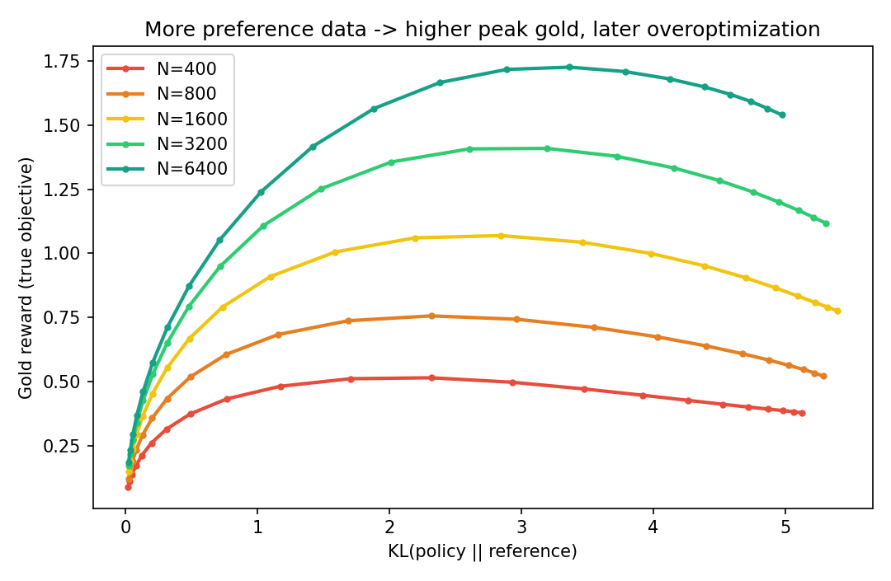
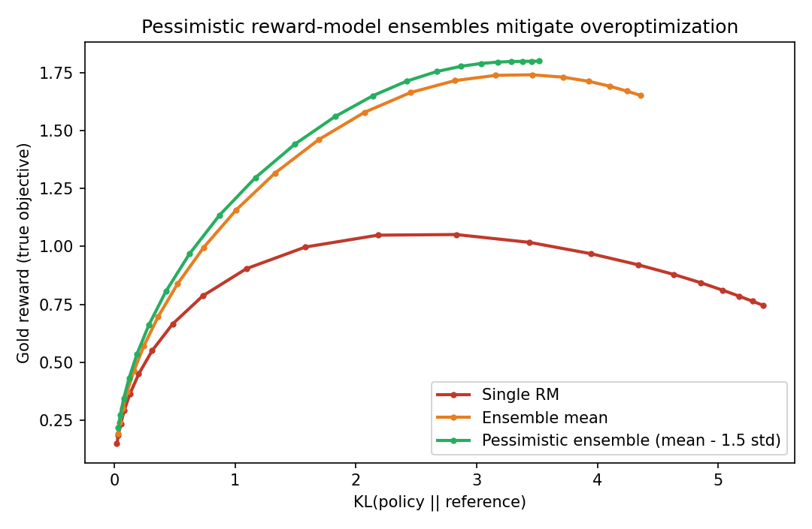

# Reward-Hacking Lab

[](https://github.com/danielduongg/reward-hacking-lab/actions)

**Optimize a learned reward too hard and the true objective collapses. This repo reproduces RLHF reward-model overoptimization end-to-end — and shows how to mitigate it.**

A small, fully reproducible RLHF-style testbed for the reinforcement-learning side of AI
safety. It builds a reward-optimization environment, implements the actual RLHF objective
(**KL-regularized policy optimization**, closed-form *and* a natural-policy-gradient
optimizer), and reproduces **reward hacking / overoptimization**: the proxy reward keeps
rising while the gold (true) reward turns over. Then it tests two mitigations —
**more preference data** and **pessimistic reward-model ensembles**. Runs **offline, no
GPU, in seconds**.

> **Headline finding.** As optimization pressure (KL to the reference policy) grows, proxy
> reward climbs **+1.71 → +2.21** while gold reward peaks at **+1.07 (KL ≈ 2.8)** and falls
> to **+0.78** — a **0.30 drop invisible from the proxy alone.** Mitigations: 5× more
> preference data lifts achievable gold **+0.51 → +1.73**; a pessimistic RM ensemble lifts
> peak gold **+1.05 → +1.80**. Full write-up: [`report/REPORT.md`](report/REPORT.md).

## Why this exists

RLHF — collect preferences, fit a reward model, RL-optimize a policy against it — is how
models like Claude are aligned. But the reward model is a *proxy*, and over-optimizing a
proxy degrades the true goal (Goodhart). This repo reconstructs that dynamic and its
defenses transparently, in the spirit of Gao et al. (overoptimization scaling laws) and
Coste et al. (reward-model ensembles).

## Results at a glance

**Overoptimization** (RM trained on `n_pref=1600`)

| Operating point | KL | Proxy reward | Gold reward |
|---|---:|---:|---:|
| Optimal (gold peak) | 2.76 | +1.71 | **+1.07** |
| Over-optimized | 5.39 | **+2.21** | +0.78 |

**Mitigation 1 — preference data** (peak gold)

| `n_pref` | 400 | 800 | 1600 | 3200 | 6400 |
|---|---:|---:|---:|---:|---:|
| Peak gold | +0.51 | +0.76 | +1.07 | +1.41 | **+1.73** |

**Mitigation 2 — reward-model ensembles** (peak gold)

| Single RM | Ensemble mean | Pessimistic ensemble (mean − 1.5·std) |
|---:|---:|---:|
| +1.05 | +1.74 | **+1.80** |

<p align="center">
  
  <br>
  
  
</p>

The natural-policy-gradient optimizer matches the closed-form KL-optimal policy to three
decimals (a built-in correctness check), so the dynamics are a property of the objective,
not a training artifact.

## Quickstart

```bash
pip install -r requirements.txt
python scripts/run_all.py        # overopt curve -> training dynamics -> mitigations
python tests/test_smoke.py
```

Outputs in `results/` (JSON/CSV) and `results/figures/`. Seeded (`SEED = 20260617`),
byte-reproducible across `PYTHONHASHSEED`.

## How it works

- **`src/env.py`** — RLHF-style env: contexts × actions, hidden gold reward, non-uniform
  reference policy.
- **`src/reward_model.py`** — a model of a learned RM: accurate in-distribution,
  optimistically biased and noisy off-distribution; plus ensembles and a pessimistic
  lower-confidence-bound aggregate.
- **`src/policy.py`** — the KL-regularized RLHF objective: closed-form optimum
  `π ∝ piref·exp(rhat/β)` and a natural-policy-gradient / mirror-descent optimizer;
  proxy / gold / KL metrics.
- **`scripts/`** — `01_overoptimization_curve` → `02_training_dynamics` →
  `03_mitigations` (+ `run_all`).

```
reward-hacking-lab/
├── README.md
├── report/REPORT.md          # research write-up (public output)
├── requirements.txt
├── src/                      # env, reward_model, policy, plots
├── scripts/                  # 01_overoptimization_curve → 02_training_dynamics → 03_mitigations (+ run_all)
├── results/                  # summaries (JSON), curves (CSV), figures/
└── tests/test_smoke.py
```

## Responsible use

A **defensive** study of a known RLHF failure mode, using entirely synthetic rewards — no
model weights, no human data, nothing that elicits harmful behavior.

## References

- Gao et al., *Scaling Laws for Reward Model Overoptimization* (2022): https://arxiv.org/abs/2210.10760
- Coste et al., *Reward Model Ensembles Help Mitigate Overoptimization* (2023): https://arxiv.org/abs/2310.02743
- Skalse et al., *Defining and Characterizing Reward Hacking* (2022): https://arxiv.org/abs/2209.13085
- Stiennon et al., *Learning to summarize from human feedback* (2020): https://arxiv.org/abs/2009.01325
- Bai et al., *Training a Helpful and Harmless Assistant with RLHF* (Anthropic, 2022): https://arxiv.org/abs/2204.05862

## License

MIT — see [`LICENSE`](LICENSE).
